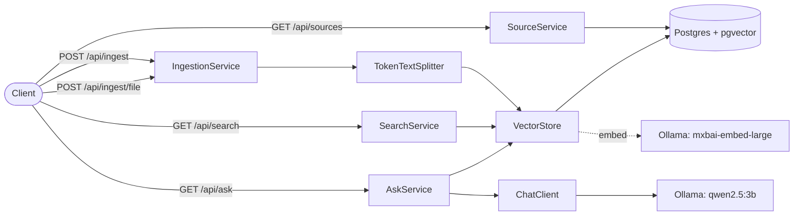

# Commonplace

Personal knowledge base with semantic search 
and RAG-powered Q&A. I made it to keep track of articles, journals, papers, and my own notes. 
Whenever I write notes after learning something new, I seldom reopen the notes and just resort to a search engine. It feels like such a shame that after the time dedicated for writing notes with my own language and understanding that helps me recall the knowledge better. 
With this it'd be easier for me to recall especially if I had written notes about it or the files that I have read. 

## What it does

The app allows user to ingest raw text or PDF/TXT/DOCX files. Ingested data is chunked and embedded with `mxbai-embed-large', then stored in Postgres with pgvector. Users can ask natural language questions and then receive answers with source that reference the chunks they came from

## Architecture

## Stack

| Component | Choice | Why                                                                                                        |
|-----------|--------|------------------------------------------------------------------------------------------------------------|
| LLM integration | Spring AI 2.0 | Native Ollama support. Provider-agnostic interfaces                                                        |
| Embeddings | mxbai-embed-large (via Ollama) | 1024 dims. Better semantic resolution than 768-dim alternatives (nomic-embed-text)                         |
| Generation | qwen2.5:3b (via Ollama) | Lightweight model. Adequate for RAG when retrieval is good                                                 |
| Vector store | Postgres + pgvector | Database for vectors and metadata. SQL for filtering and joins                                             |
| Index | HNSW | Fast approximate nearest-neighbor search. This works with incremental ingestion                            |
| Distance metric | Cosine | Text embeddings encode direction, not magnitude. Cosine measures angle, which maps to semantic similarity. |
| Chunking | Spring AI `TokenTextSplitter` | It respects punctuation, supports overlapping, and is token-aware                                          |
| File extraction | Apache Tika | Single API for PDF, DOCX, XLSX, HTML. Format detection built in                                            |

## Setup

### Prerequisites

- Java 25 (only needed for development)
- Docker
- [Ollama](https://ollama.com)

### Steps

1. **Configure environment**

        cp .env.example .env

2. **Pull models**

        ollama pull mxbai-embed-large
        ollama pull qwen2.5:3b

3. **Choose how to run**

   **Development**:

        docker compose up -d          # start Postgres
        ./mvnw spring-boot:run        # run app on host

   **Everything in docker**:

        docker compose --profile full up -d --build

   Open http://localhost:8080

## API

| Method | Endpoint | Purpose | Request             |
|--------|----------|---------|---------------------|
| POST | `/api/ingest` | Ingest raw text | JSON`{text,source}` |
| POST | `/api/ingest/file` | Ingest a document (PDF, DOCX, TXT, MD) | Multipart `file`     |
| GET | `/api/search` | Retrieve similar chunks without generation | `?q=...`            |
| GET | `/api/ask` | Retrieve chunks and generate an answer | `?q=...`            |
| GET | `/api/sources` | List ingested sources with chunk counts | -                   |
| GET | `/api/sources/{source}/chunks` | Get all chunks for one source | -                   |
Interactive docs at `http://localhost:8080/swagger-ui.html`

## Example

**Ingest a note:**

    curl -X POST localhost:8080/api/ingest \
      -H "Content-Type: application/json" \
      -d '{"text": "Octopuses have three hearts. Two pump blood to the gills, one pumps it to the rest of the body. The third heart stops beating when they swim, which is why they prefer crawling.", "source": "ocean-facts.md"}'

**Ask a question about it:**

    curl "localhost:8080/api/ask?q=why%20do%20octopuses%20prefer%20crawling"

    {
      "answer": "The reason Octopuses prefer crawling is because their third heart stops beating when they swim, affecting their blood flow.",
      "sourceRefs": [
        {
          "text": "Octopuses have three hearts. Two pump blood to the gills, one pumps it to the rest of the body. The third heart stops beating when they swim, which is why they prefer crawling.",
          "source": "ocean-facts.md",
          "score": 0.81
        }
      ]
    }
the formula for score is 1 - cosine distance

## Why RAG? Why not MCP?
RAG fits better for this use case. It retrieves first, then the LLM answers over a fixed set of chunks (top-K). That means retrieval is deterministic, not probabilistic so the same question returns the same sourceRefs every time, and every answer traces back to chunks from ingested text or files.

With MCP, the same question can lead to different answers because the model decides what to fetch at query time. For a personal knowledge base, that defeats the purpose. The whole point is to store what I've learned and read, and to retrieve it reliably. If retrieval isn't reproducible, I might as well just use a search engine.

Which I already have. It's called a browser.

## Known limitations

- Text extraction quality varies with PDF layout (e.g. newspaper)
- Local LLM (qwen2.5:3b) is fast but less accurate than hosted models
- No URL ingestion (by design)

## Roadmap 
 - Stream tokens from the LLM as they are generated 
 - Deduplication by content-hash the file or text before chunking
 - Async ingestion 
 - Metadata filtering
 - BM25 keyword matching

## License

MIT